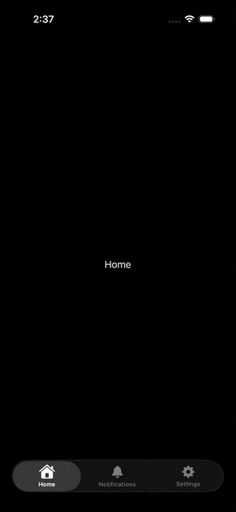

# AnimatedGlassTabs
A SwiftUI iOS 26+ custom TabView with liquid glass effect and animated tab icons.

[中文版 README](README_CN.md)

## Demo


## Features
- 🌟 **Liquid Glass Effect**: Beautiful glassmorphism design for the tab bar
- 🎨 **Animated Icons**: Smooth icon animations with scale and rotation effects
- ⚡ **SwiftUI Native**: Built entirely with SwiftUI and iOS 26+ APIs
- 🔧 **Customizable**: Easy to customize colors, animations, and tab items
- 📱 **iOS 26+ Compatible**: Uses the latest iOS features and design patterns

## Installation

### Requirements
- iOS 26.0+
- Swift 5.9+

### Clone the Repository
```bash
git clone https://github.com/yourusername/AnimatedGlassTabs.git
cd AnimatedGlassTabs
```

## Usage
### Basic Implementation

```swift
import SwiftUI

struct ContentView: View {
    @State private var activeTab: CustomTab = .home
    
    var body: some View {
        TabView(selection: $activeTab) {
            Tab.init(value: .home) {
                Text("Home")
                    .toolbarVisibility(.hidden, for: .tabBar)
            }
            
            Tab.init(value: .notifications) {
                Text("Notification")
                    .toolbarVisibility(.hidden, for: .tabBar)
            }
            
            Tab.init(value: .settings) {
                Text("Settings")
                    .toolbarVisibility(.hidden, for: .tabBar)
            }
        }
        .safeAreaInset(edge: .bottom, spacing: 0) {
            CustomTabBarView()
                .padding(.horizontal, 20)
        }
    }
}
```

### Custom Tab Definition

```swift
enum CustomTab: String, CaseIterable {
    case home = "Home"
    case notifications = "Notifications"
    case settings = "Settings"
    
    var symbol: String {
        switch self {
        case .home: return "house"
        case .notifications: return "bell"
        case .settings: return "gearshape"
        }
    }
    
    var selectedSymbol: String {
        switch self {
        case .home: return "house.fill"
        case .notifications: return "bell.fill"
        case .settings: return "gearshape.fill"
        }
    }
}
```

## Project Structure

```
AnimatedGlassTabs/
├── AnimatedGlassTabsApp.swift    # Main app entry point
├── ContentView.swift             # Main view with TabView implementation
├── CustomTabBar.swift            # Custom tab bar with glass effect
└── Assets.xcassets/              # App assets and icons
```

## Key Components

### CustomTabBar
A `UIViewRepresentable` wrapper around `UISegmentedControl` that provides:
- Glass effect styling
- Custom tab item rendering
- Smooth selection animations

### Animation System
- **Scale Animation**: Icons scale up (1.15x) when selected
- **Rotation Animation**: 360-degree rotation on tab selection
- **Spring Physics**: Natural bounce effect with customizable damping

## Credits
This project is inspired by [Kavsoft's YouTube tutorial](https://www.youtube.com/watch?v=wfHIe8GpKAU) on creating custom LiquidGlass TabView, with additional animated icon effects.

## License
This project is licensed under the MIT License - see the [LICENSE](LICENSE) file for details.

## Acknowledgments
- [Kavsoft](https://www.youtube.com/c/Kavsoft) for the original LiquidGlass TabView concept