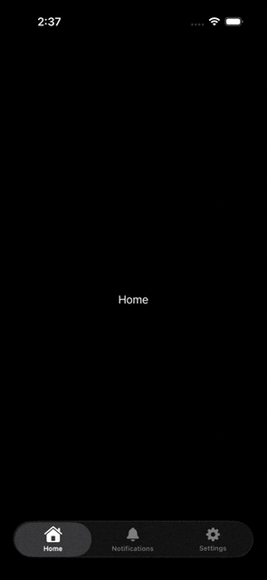

# AnimatedGlassTabs

一個基於 SwiftUI iOS 26+ 的自定義 TabView，具有液體玻璃效果和動畫標籤圖標。

[English README](README.md)

## 演示


## 功能特色

- 🌟 **液體玻璃效果**：標籤欄採用美麗的玻璃態設計
- 🎨 **動畫圖標**：平滑的圖標動畫，包含縮放和旋轉效果
- ⚡ **SwiftUI 原生**：完全使用 SwiftUI 和 iOS 26+ API 構建
- 🔧 **可自定義**：輕鬆自定義顏色、動畫和標籤項目
- 📱 **iOS 26+ 兼容**：使用最新的 iOS 功能和設計模式

## 安裝

### 系統需求

- iOS 26.0+
- Swift 5.9+

### 克隆倉庫

```bash
git clone https://github.com/yourusername/AnimatedGlassTabs.git
cd AnimatedGlassTabs
```

## 使用方法

### 基礎實現

```swift
import SwiftUI

struct ContentView: View {
    @State private var activeTab: CustomTab = .home
    
    var body: some View {
        TabView(selection: $activeTab) {
            Tab.init(value: .home) {
                Text("首頁")
                    .toolbarVisibility(.hidden, for: .tabBar)
            }
            
            Tab.init(value: .notifications) {
                Text("通知")
                    .toolbarVisibility(.hidden, for: .tabBar)
            }
            
            Tab.init(value: .settings) {
                Text("設定")
                    .toolbarVisibility(.hidden, for: .tabBar)
            }
        }
        .safeAreaInset(edge: .bottom, spacing: 0) {
            CustomTabBarView()
                .padding(.horizontal, 20)
        }
    }
}
```

### 自定義標籤定義

```swift
enum CustomTab: String, CaseIterable {
    case home = "首頁"
    case notifications = "通知"
    case settings = "設定"
    
    var symbol: String {
        switch self {
        case .home: return "house"
        case .notifications: return "bell"
        case .settings: return "gearshape"
        }
    }
    
    var selectedSymbol: String {
        switch self {
        case .home: return "house.fill"
        case .notifications: return "bell.fill"
        case .settings: return "gearshape.fill"
        }
    }
}
```

## 專案結構

```
AnimatedGlassTabs/
├── AnimatedGlassTabsApp.swift    # 主應用程式入口點
├── ContentView.swift             # 包含 TabView 實現的主視圖
├── CustomTabBar.swift            # 具有玻璃效果的自定義標籤欄
└── Assets.xcassets/              # 應用程式資源和圖標
```

## 核心組件

### CustomTabBar
一個 `UIViewRepresentable` 包裝器，圍繞 `UISegmentedControl` 提供：
- 玻璃效果樣式
- 自定義標籤項目渲染
- 平滑選擇動畫

### 動畫系統
- **縮放動畫**：選中時圖標放大（1.15倍）
- **旋轉動畫**：標籤選擇時 360 度旋轉
- **彈簧物理**：具有可自定義阻尼的自然彈跳效果

## 致謝

本專案靈感來自 [Kavsoft 的 YouTube 教學影片](https://www.youtube.com/watch?v=wfHIe8GpKAU)，該影片介紹如何創建自定義 LiquidGlass TabView，並在此基礎上添加了動畫圖標效果。


## 授權
本專案採用 MIT 授權 - 詳情請參閱 [LICENSE](LICENSE) 文件。


## 特別感謝
- [Kavsoft](https://www.youtube.com/c/Kavsoft) 